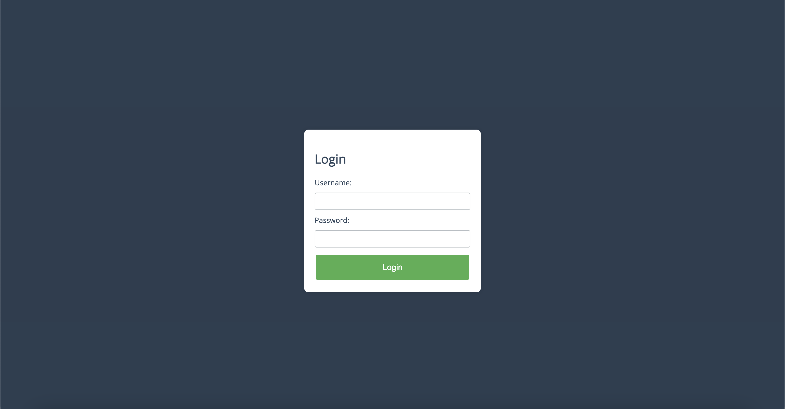
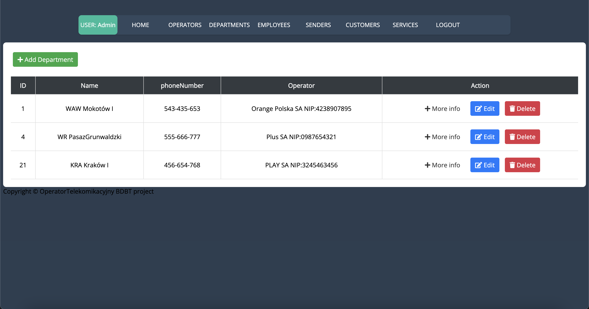
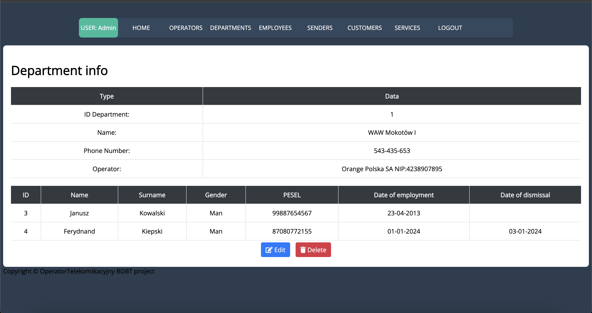
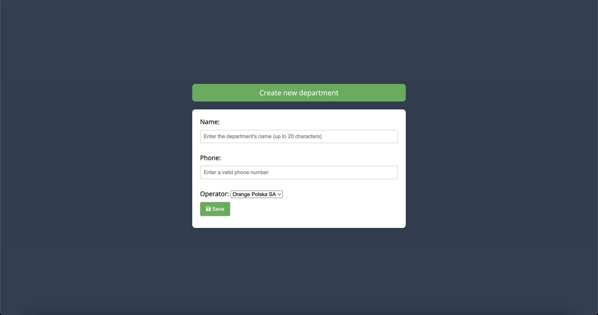
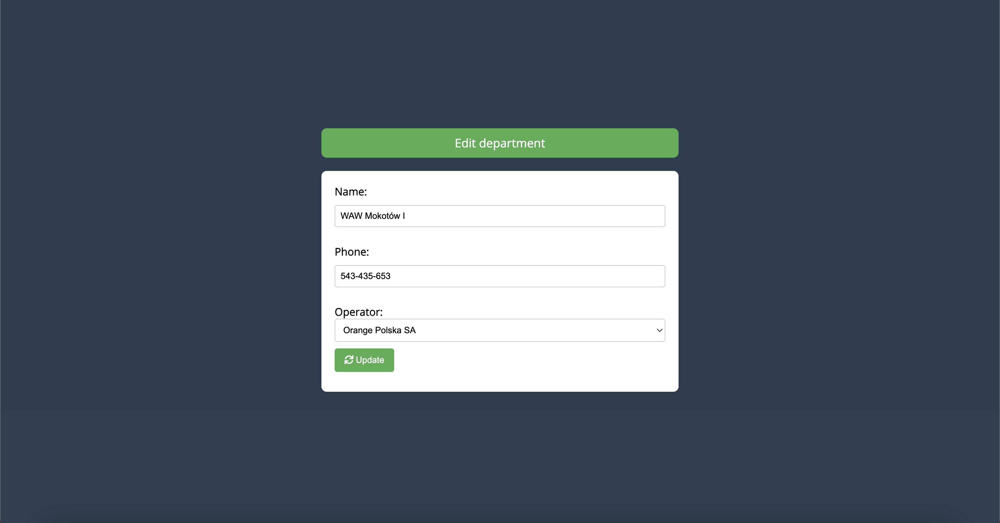

# Operator-spring-boot-thymeleaf
======================================
Operator Spring Boot Thymeleaf - CRUD application with Maven, Bootstrap, Spring Data JPA, Web MVC.

Used:
-------------
- `Spring Boot`
- `Spring Security`
- `Spring Hibernate JPA`
- `Thymeleaf` with following dialects: Java 8 Time, Layout and Security
- `CSS`
- `JavaScript`


Building the project
--------------------

Clone the repository:

    git clone https://github.com/mrkuba1/Operator-spring-boot-thymeleaf

Download ojdbc11.jar from Oracle and update the path in `pom.xml`

Create file `.env` in `/src/main/resources/`

Insert file `.env`, example:
```
    ORACLE_HOST="YOUR_IP"
    ORACLE_USERNAME="LOGIN"
    ORACLE_PASSWORD="PASSWORD"
```

Navigate to the newly created folder:

    cd operator-spring-boot-thymeleaf

Run the project with:

    ./mvnw clean spring-boot:run

Navigate to:

    http://localhost:8080

Login with: `user` and `admin`

Package the application
-----------------------

To package the project run:

    ./mvnw clean package

Screenshots
-----------

- Login



- Home Admin


- Departments



- Department Info



- Department Add



- Department Edit



More screens can be found in folder `screens`.

